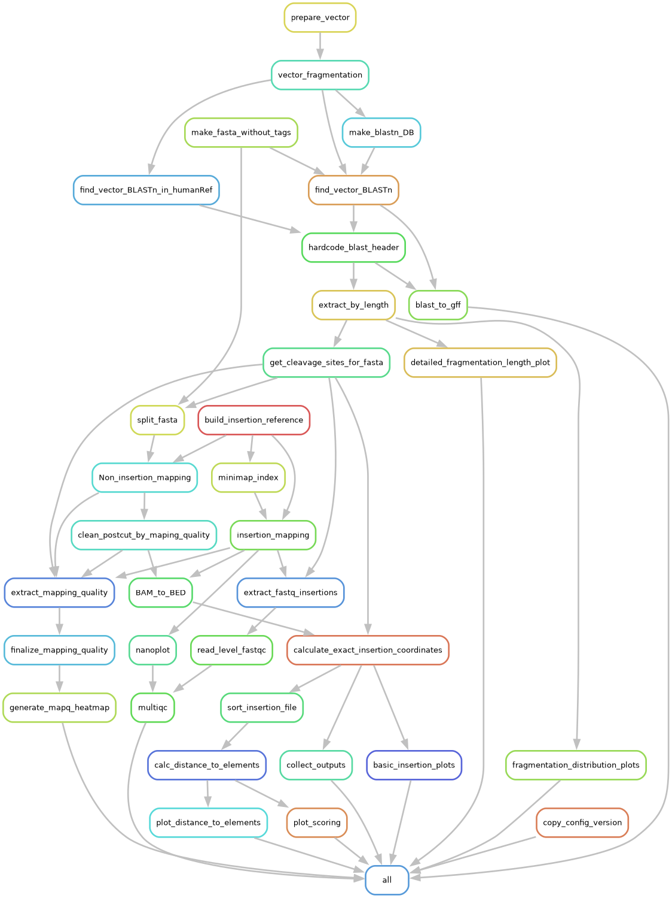

# Vector Insertion Site Detection

Welcome to the documentation for the **Vector Insertion Site Detection Pipeline**. This Snakemake workflow helps researchers detect and annotate insertion sites with known sequences in long-read DNA sequencing data.

## Features
- Systematic search for insertion sequences.
- Localize insertion sites with reference genome information.
- Annotate insertion sites with biological data

## Documentation Overview

- [Getting Started](getting_started.md)
- [Configuration](config.md)
- [Usage](usage.md)
- [Tutorial](tutorial.md)
- [Advanced Usage](advanced_usage.md)
- [Contribution](other.md)
- [Citation](other.md)