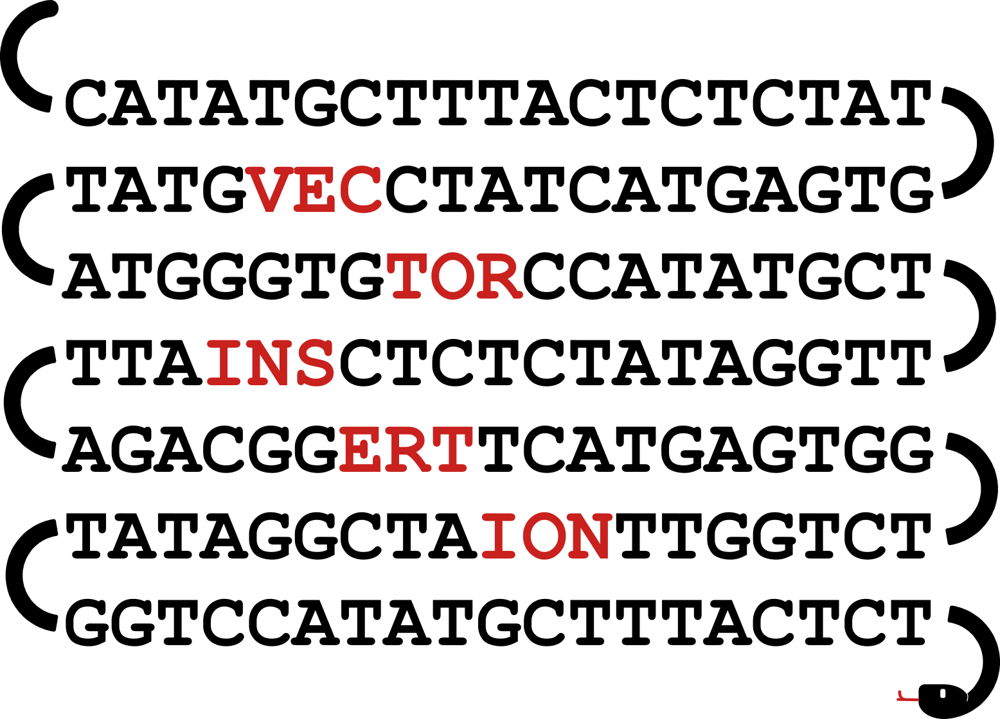
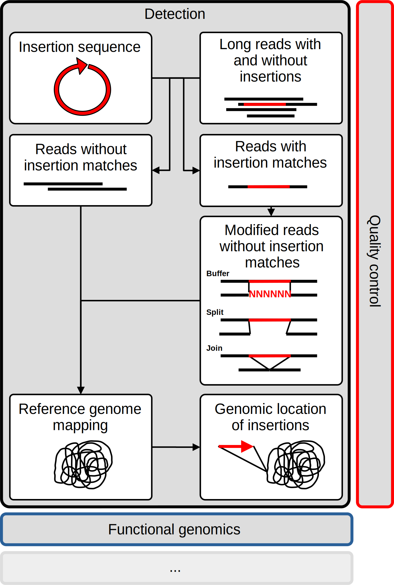
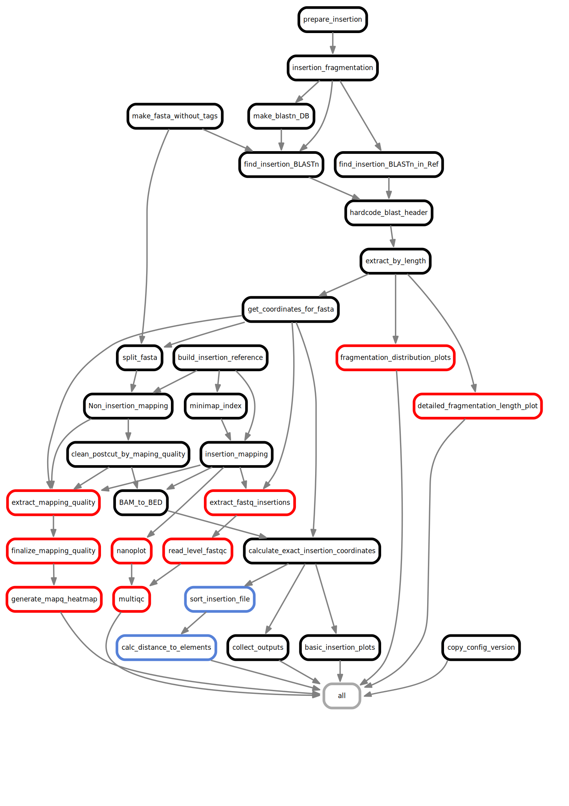

    

# Vector Insertion Site – Detection Pipeline

## Introduction
Welcome to the documentation for the **Vector Insertion Site (VIS) Detection Pipeline**. This **Snakemake** workflow helps researchers detect and annotate insertion sites with known sequences in long-read DNA sequencing data. The workflow is fully extensible with customized functions and adheres to the Snakemake styling guide. The basic detection workflow is illustrated in [Figure 1](#figure-1-illustrated-core-functionality) with some of the key analysis steps. A detailed structure for the Snakemake pipeline can be found in [Figure 2](#figure-2-dag-of-the-workflow), where a directed acyclic graph (DAG) of the individual rules provides an overview of the workflow components.

Detailed explanations of the detection pipeline can be found [here](). In brief, a known target insertion (i.e. vector) is fragmented into smaller DNA sequences and used for a sequence similarity search against reads from long-read DNA sequencing. Matching reads are subjected to one of three types of modifications (buffer, split, join). These modified reads are subsequently mapped against their respective reference genome, and the exact genomic location of the insertion is calculated using a CIGAR-based approach. Finally, genomic annotations are utilized to calculate the distances of specific elements (genes, transcription factors, etc.) to the detected insertion sites.

#### Figure 1: Illustrated Core Functionality

    

 
Below is the DAG of the Snakemake workflow. The individual rules are broadly colored according to the different parts of the workflow illustrated above. 

#### Figure 2: DAG of the Workflow

    

## Key Features
- Highly sensitive and systematic detection of insertion sequences
- Precise localization of insertion sites using reference genome data
- Annotation of insertion sites with relevant biological information
- Fully customizable and extendable functionality

## Citation
If you are using this pipeline or the search strategy implemented in this pipeline, please cite us using "github.com/aweich/VIS-dp". 

## Contribution
We encourage contributions to enhance and refine this codebase, whether through providing feedback, improving functionality, or sharing domain-specific expertise. If you have suggestions, encounter issues, or require assistance, please feel free to reach out for support and collaboration.