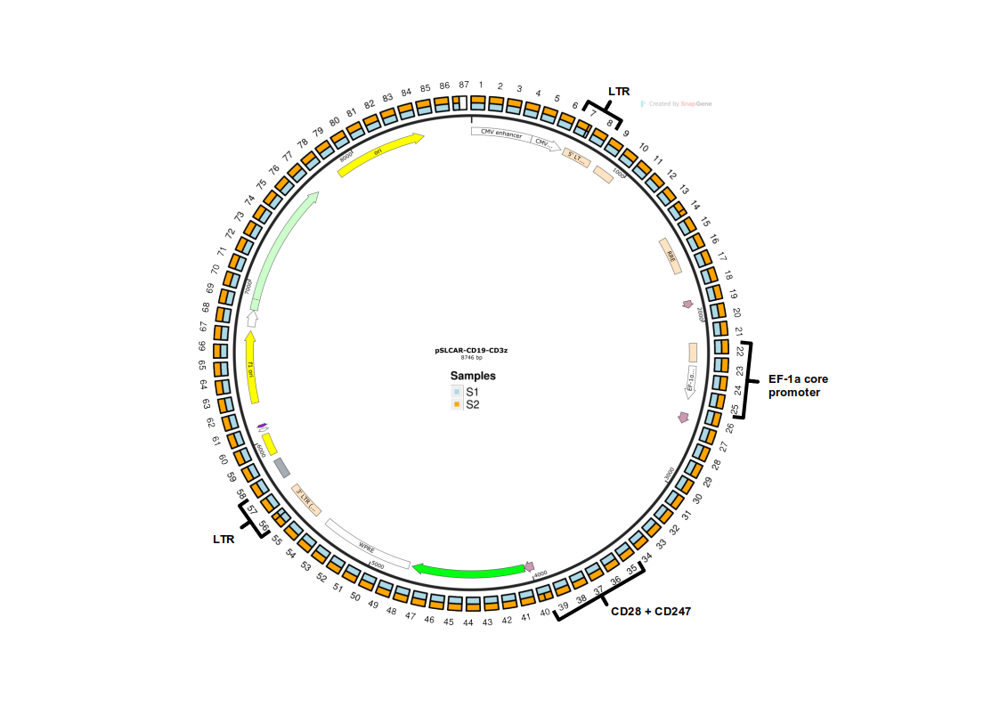

### Simulation data for tutorial
#### Reference genome

The first 500kb of chromosome 1 from the `hg38` assembly was used as the reference genome. The extracted sequence was saved as `chr1` in the FASTA format, which was then used for subsequent simulations and as reference genome for the [tutorial](../tutorial/tutorial_before.md/#prepare-configyml).

#### Insertion sequence

The insertion sequence for the simulation was based on the [pSLCAR-CD19-CD3z vector construct](http://n2t.net/addgene:135993), obtained from Addgene (Plasmid # 135993). 

The construct encapsulates a a CAR T cell vector sequence and was developed by [Scott McComb and colleagues](https://www.sciencedirect.com/science/article/pii/S2329050120300231?via%3Dihub). The vector architecture is illustrated below with some key features highlighted, as well as with an illustration of the 100bp-long fragmentation used in the [tutorial](../tutorial/tutorial_intro.md). 



!!! Hint "Further Details"

    Lentivirus-based transduction systems generally integrate the DNA sequence between the two long terminal repeats (LTRs). In a biological context, we would typically observe only the sequence between the 5' LTR and the 3' LTR, rather than the entire vector construct. To maintain simplicity in the simulated data, this specific adjustment to the vector sequence has not been made.

#### Read data generation

1. **Reference Genome Sampling:** 1000 reads were sampled from the reference genome with a mean read length of 10,000 bp, generated from a log-normal distribution.
2. **Insertion Introduction:** 5 of the 1000 reads were randomly chosen to receive an insertion, either the full-length or part of the construct, with random insertion directionality (`+` or `-`).
3. **Generation of Samples:** The process was repeated twice to generate two samples (`S1` and `S2`), each with a summary of the expected insertion locations.
4. **BAM generation:** Both samples were mapped against the reference genome to generate BAM files using:
 
```bash
minimap2 -ax map-ont chr1_1_50000_ref.fa S1.fa | samtools sort | samtools view -F 2304 -o S1.bam
```

This simulation provides a set of reads with varying insertion locations for evaluating the pipeline's detection and analysis capabilities.

<details>
  <summary>Full Simulation Code:</summary>

```python
#!/usr/bin/env python3

import random
import numpy as np
from Bio import SeqIO
from Bio.Seq import Seq  # For reverse complement

# Paths to input files
reference_genome_path = "chr1_1_50000_ref.fa" # Reference genome
vector_sequence_path = "vectorseq.fa"   # Vector sequence

random.seed(2101)  # Seed for random, S1: 2101 and S2: 2015
np.random.seed(2101)  # Seed for numpy.random, S1: 2101 and S2: 2015

def collapse_fasta(fastapath):
    """Collapses multi-line FASTA sequences into a single string."""
    with open(fastapath, 'r') as fasta_file:
        seq_list = []
        for record in SeqIO.parse(fasta_file, 'fasta'):
            seq_list.append(str(record.seq))
    return ''.join(seq_list)

def generate_reads(reference_genome, mean_read_length=10000, num_reads=1000):
    """Generates random reads from the reference genome."""
    reads = []
    # Create read lengths following a log-normal distribution
    read_length_distribution = np.random.lognormal(mean=np.log(mean_read_length) - 0.5, sigma=1.0, size=num_reads)
    for read_length in read_length_distribution:
        read_length = int(read_length)  # Ensure lengths are integers
        start_position = random.randint(0, len(reference_genome) - read_length)
        read = reference_genome[start_position:start_position + read_length]
        reads.append(read)
    return reads

def add_insertions_to_reads(reads, insertion_sequence, num_insertions):
    """Adds insertions with strandedness to randomly selected reads."""
    insertion_summary = []  # To store insertion details for the summary
    for _ in range(num_insertions):
        strand = None
        # Randomly select a read to modify
        read_index = random.randint(0, len(reads) - 1)
        read = reads[read_index]

        # Decide whether to use the full insertion or a partial sequence
        if random.choice([True, False]):  # 50% chance
            insertion = insertion_sequence  # Full insertion
        else:
            start = random.randint(0, len(insertion_sequence) - 2000)
            end = start + random.randint(2000, min(5000, len(insertion_sequence) - start))
            insertion = insertion_sequence[start:end]  # Partial insertion

        # Decide the strandedness of the insertion
        if random.choice([True, False]):  # 50% chance for negative strand
            insertion = str(Seq(insertion).reverse_complement())  # Reverse complement for negative strand
            strand = "-" 
        
        if strand is None: #default to positive
            strand = '+'
        
        # Insert the sequence at a random position in the read
        insert_position = random.randint(0, len(read))
        modified_read = read[:insert_position] + insertion + read[insert_position:]

        # Replace the original read with the modified read
        reads[read_index] = modified_read

        # Store the details of the insertion
        insertion_summary.append((f'Read-{read_index + 1}', len(insertion), strand))

    return reads, insertion_summary

# Collapse the FASTA files into single sequences
reference_genome = collapse_fasta(reference_genome_path)
vector_sequence = collapse_fasta(vector_sequence_path)

# Generate reads and add insertions
non_insertion_reads = generate_reads(reference_genome)  # Reads without insertions
insertion_reads, insertion_summary = add_insertions_to_reads(non_insertion_reads.copy(), vector_sequence, 5)

# Combine reads and save them to a file
total_reads = insertion_reads + non_insertion_reads

output_file_path = "S1.fa"
with open(output_file_path, 'w') as output_file:
    for i, read in enumerate(total_reads):
        output_file.write(f'>Read-{i+1}\n{read}\n')

# Print the summary of insertions
print("Summary of Inserted Reads:")
for read_name, insertion_length, strand in insertion_summary:
    print(f"{read_name}: Insertion length = {insertion_length}, Strand = {strand}")

# Save summary to a file
summary_file_path = "S1_InsertionSummary.txt"
with open(summary_file_path, 'w') as summary_file:
    summary_file.write("Summary of Inserted Reads:\n")
    for read_name, insertion_length, strand in insertion_summary:
        summary_file.write(f"{read_name}: Insertion length = {insertion_length}, Strand = {strand}\n")

# Debugging outputs
print(f"Total reads: {len(total_reads)}")
```
</details>

<details>
  <summary>Summary of Inserted Reads for S1:</summary>
```
Read-745: Insertion length = 8746, Strand = -
Read-555: Insertion length = 8746, Strand = +
Read-561: Insertion length = 2248, Strand = +
Read-343: Insertion length = 8746, Strand = +
Read-902: Insertion length = 8746, Strand = +
```
</details>
<details>
  <summary>Summary of Inserted Reads for S2:</summary>

```
Read-522: Insertion length = 8746, Strand = +
Read-824: Insertion length = 8746, Strand = -
Read-262: Insertion length = 2532, Strand = -
Read-417: Insertion length = 2593, Strand = -
Read-682: Insertion length = 8746, Strand = +
```
</details>
<br> 

#### Annotation data processing

The gene annotation data was obtained from UCSC by selecting the region `chr1:1-500,000` from the `All GENCODE V44` track and downloading the selection with the `"All fields from selected table"` output format.
<details>
  <summary>Full Annotation Data Processing </summary>
<br>
The raw donloaded table had the following format:
```plaintext
#bin	name	chrom	strand	txStart	txEnd	cdsStart	cdsEnd	exonCount	exonStarts	exonEnds	score	name2	cdsStartStat	cdsEndStat	exonFrames
585	ENST00000456328.2	chr1	+	11868	14409	11868	11868	3	11868,12612,13220,	12227,12721,14409,	0	DDX11L2	none	none	-1,-1,-1,
585	ENST00000619216.1	chr1	-	17368	17436	17368	17368	1	17368,	17436,	0	MIR6859-1	none	none	-1,
585	ENST00000473358.1	chr1	+	29553	31097	29553	29553	3	29553,30563,30975,	30039,30667,31097,	0	MIR1302-2HG	none	none	-1,-1,-1,
585	ENST00000469289.1	chr1	+	30266	31109	30266	30266	2	30266,30975,	30667,31109,	0	MIR1302-2HG	none	none	-1,-1,
...
```

It was then processed with the command: 

```bash
cat UCSC_genes_chr1_0_500000 | cut -f 3,4,5,6,13 | awk -v OFS="\t" 'NR > 1 {print $1, $3, $4, $5, ".", $2}' - | sort -k1,1 -k2,2n > UCSC_genes_chr1_0_500000
```

This converted the table into the desired BED6 format:
```plaintext
chr1	11868	14409	DDX11L2	.	+
chr1	17368	17436	MIR6859-1	.	-
chr1	29553	31097	MIR1302-2HG	.	+
...
```

</details>

 show the vector sequence and how it is fragmented into 100bp sized-fragments
