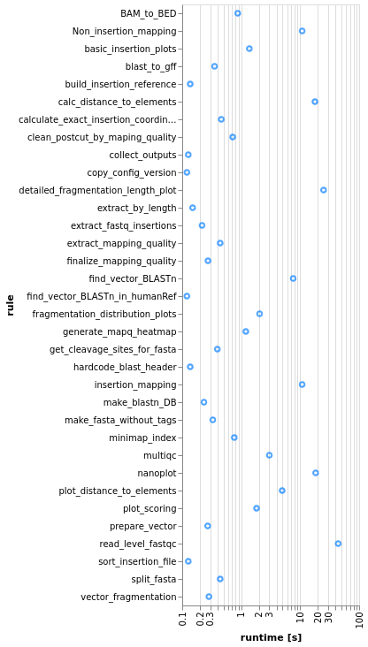
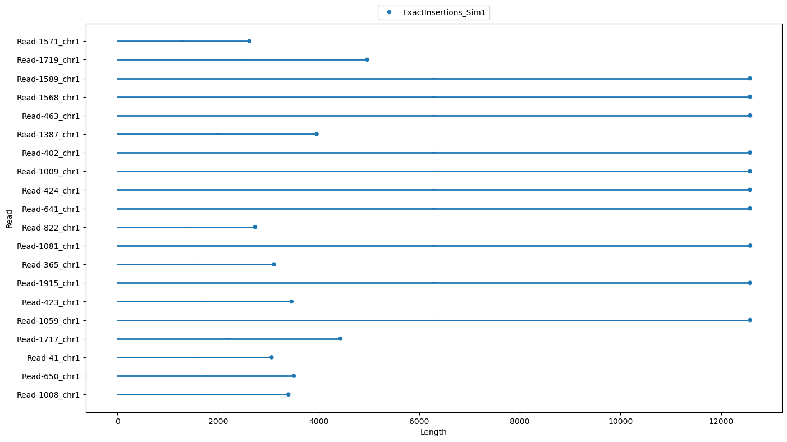
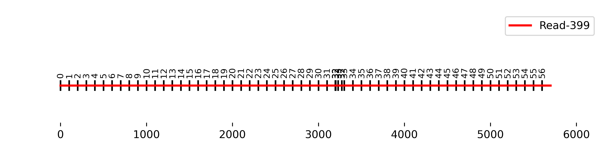
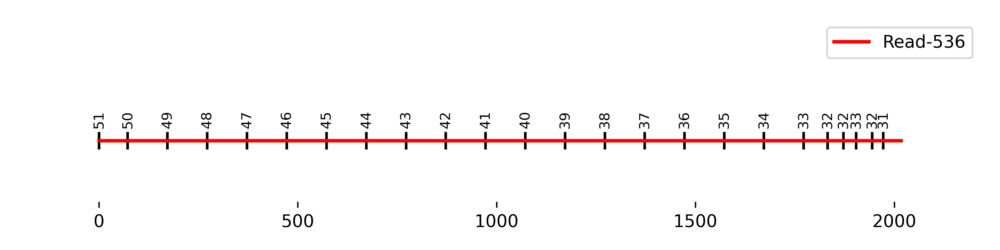

# Tutorial

Let's now look at a minimal example of what the pipeline can do for you. For this, we have simulated some sequencing data and randomly added insertions to some of them. For more on this, check [here](other.md/#simulate_data_for_tutorial).

Before we are getting started, make sure that you have all at hand that is needed. You can easily check this by typing: 

```bash
    snakemake -n
```
If you now see a list of jobs that wait for execution, you are fully equipped for what comes next.

!!! info For this tutorial, we execute the workflow based on the alternative setup. Just add `--use-conda` if this is not what you chose. 

## Collect the reference files

To let the pipeline know where our samples and other dependencies are located, we now need to open and edit the configuration file. Open the `config.yml` file and fill the missing dependencies as follows:

```yaml
# tutorial config
experiment: "tutorial"
samples:
    S1: "tutorial/simulated/S1.bam",
    S2: "tutorial/simulated/S2.bam"
processing_dir: "tutorial/out"
vector_fasta: "tutorial/references/vectorseq.fa"
splitmode: "Buffer"
fragment_size: 100
MinLength: 1
MAPQ: 10
MinInsertionLength: 500
ref_genome_ctrl: "tutorial/references/chr1region.fa"
annotation_1: "tutorial/references/UCSC_GENCODEV44_chr1region.bed"
detection: "rules/detection.smk"
quality_control: "rules/qc.smk"
functional_genomics: "rules/functional_genomics.smk"
```

## Run the pipeline

Let's run one more dry-run of the workflow to see if the `config` has been put together correctly. 

```bash
> snakemake --cores 2 -n
...
Job stats:
job                                      count
-------------------------------------  -------
BAM_to_BED                                   2
Non_insertion_mapping                        2
all                                          1
basic_insertion_plots                        1
build_insertion_reference                    1
calc_distance_to_elements                    2
calculate_exact_insertion_coordinates        2
clean_postcut_by_maping_quality              2
collect_outputs                              2
copy_config_version                          1
detailed_fragmentation_length_plot           2
extract_by_length                            2
extract_fastq_insertions                     2
extract_mapping_quality                      2
finalize_mapping_quality                     2
find_vector_BLASTn                           2
find_vector_BLASTn_in_humanRef               2
fragmentation_distribution_plots             2
generate_mapq_heatmap                        2
get_cleavage_sites_for_fasta                 2
hardcode_blast_header                        2
insertion_mapping                            2
make_blastn_DB                               1
make_fasta_without_tags                      2
minimap_index                                1
multiqc                                      1
nanoplot                                     2
plot_distance_to_elements                    2
plot_scoring                                 2
prepare_vector                               1
read_level_fastqc                            2
sort_insertion_file                          2
split_fasta                                  2
vector_fragmentation                         1
total                                       59
```

All of these jobs will be executed in the correct order by the workflow. So let's finally run it.

```bash
    snakemake --cores 2
```
!!! info Depending on the amount of cores specified and whether the single envs need to be built for the first time, this might take a while. However, since the simulated data is very small, the expected runtime should not exceed more than 5-10 minutes. 

If you see this, the workflow executed successfully and ran through completely. If not, jump to the [error handling](#error-handling) section. 

```bash
    Finished job 0.
    59 of 59 steps (100%) done
``` 

Now run snakemake again with its inbuilt `--report` functionality to get a comprehensive overview about the workflow's runtime and output. 

```bash
    snakemake --report
```

### Inspecting the output

#### Report

Since we now have also automatically generated a general report for the workflow stored in the working directory of the pipeline. 
Take a look at the Statistics in `report.html`. Some rules took significantly longer to finish than others.



Throughout the pipeline, some simple plots are also generated to give us a glimpse of what the insertions look like in terms of their length or chromosomal specificity. Navigate to the results tab and take a look at the detected lengths of your insertions. It looks like some of the reads only contained parts of the insertion.



If you further want to get an idea about quality control metrics, navigate to the `multiqc.html` report in the results tab. 

#### Output files

Let's now have a look at the directly generated output files. Navigate to the output folder as defined in the `config`. If you want to have an overview about the file structure of this directory, run `tree "tutorial/out/tutorial"`. 

Below, there is a list of the most important output files of the pipeline with a short description. 

<details>
  <summary>Output directory structure:</summary>

├── config_settings.yml
├── final
│   ├── functional_genomics
│   │   ├── Functional_distances_to_Insertions_S1.bed
│   │   ├── Functional_distances_to_Insertions_S2.bed
│   │   ├── Insertion_Scoring_S1.png
│   │   ├── Insertion_Scoring_S2.png
│   │   ├── Plot_Distance_to_Genes_100_S1.png
│   │   └── Plot_Distance_to_Genes_100_S2.png
│   ├── localization
│   │   ├── ExactInsertions_S1.bed
│   │   ├── ExactInsertions_S2.bed
│   │   ├── Heatmap_Insertion_Chr.png
│   │   └── Insertion_length.png
│   └── qc
│       ├── Fragmentation
│       │   ├── Insertions
│       │   │   ├── insertions_100_S1
│       │   │   │   ├── 100_fragmentation_distribution.png
│       │   │   │   └── 100_read_match_fragmentation_distribution.png
│       │   │   └── insertions_100_S2
│       │   │       ├── 100_fragmentation_distribution.png
│       │   │       └── 100_read_match_fragmentation_distribution.png
│       │   ├── Longest_Interval
│       │   │   ├── S1
│       │   │   │   ├── Longest_interval_Read-221.png
│       │   │   │   ├── Longest_interval_Read-399.png
│       │   │   │   ├── Longest_interval_Read-46.png
│       │   │   │   ├── Longest_interval_Read-536.png
│       │   │   │   └── Longest_interval_Read-628.png
│       │   │   └── S2
│       │   │       ├── Longest_interval_Read-328.png
│       │   │       ├── Longest_interval_Read-347.png
│       │   │       ├── Longest_interval_Read-389.png
│       │   │       ├── Longest_interval_Read-532.png
│       │   │       └── Longest_interval_Read-920.png
│       │   └── Reference
│       │       ├── reference_100_S1
│       │       │   └── 100_fragmentation_distribution.png
│       │       └── reference_100_S2
│       │           └── 100_fragmentation_distribution.png
│       └── multiqc_report.html
└── intermediate
    ├── blastn
    │   ├── 100_VectorMatches_S1.blastn
    │   ├── 100_VectorMatches_S2.blastn
    │   ├── Annotated_100_VectorMatches_S1.blastn
    │   ├── Annotated_100_VectorMatches_S2.blastn
    │   ├── CleavageSites_100_VectorMatches_S1.blastn
    │   ├── CleavageSites_100_VectorMatches_S2.blastn
    │   ├── Filtered_Annotated_100_VectorMatches_S1.blastn
    │   ├── Filtered_Annotated_100_VectorMatches_S2.blastn
    │   ├── humanref
    │   │   ├── Annotated_100_VectorMatches_S1.blastn
    │   │   ├── Annotated_100_VectorMatches_S2.blastn
    │   │   ├── Filtered_Annotated_100_VectorMatches_S1.blastn
    │   │   └── Filtered_Annotated_100_VectorMatches_S2.blastn
    │   ├── Readnames_100_VectorMatches_S1.txt
    │   └── Readnames_100_VectorMatches_S2.txt
    ├── fasta
    │   ├── Cleaved_S1_noVector.fa
    │   ├── Cleaved_S2_noVector.fa
    │   ├── fragments
    │   │   ├── 100_Vector_fragments.fa
    │   │   ├── 100_Vector_fragments.fa.ndb
    │   │   ├── 100_Vector_fragments.fa.nhr
    │   │   ├── 100_Vector_fragments.fa.nin
    │   │   ├── 100_Vector_fragments.fa.njs
    │   │   ├── 100_Vector_fragments.fa.not
    │   │   ├── 100_Vector_fragments.fa.nsq
    │   │   ├── 100_Vector_fragments.fa.ntf
    │   │   ├── 100_Vector_fragments.fa.nto
    │   │   └── Forward_Backward_Vector.fa
    │   ├── Full_S1.fa
    │   ├── Full_S2.fa
    │   ├── Insertion_S1_Vector.fa
    │   └── Insertion_S2_Vector.fa
    ├── localization
    │   ├── ExactInsertions_S1.bed
    │   ├── ExactInsertions_S2.bed
    │   ├── Sorted_ExactInsertions_S1.bed
    │   └── Sorted_ExactInsertions_S2.bed
    ├── log
    │   ├── detection
    │   │   ├── BAM_to_BED
    │   │   │   ├── Postcut_S1.log
    │   │   │   ├── Postcut_S2.log
    │   │   │   ├── Precut_S1.log
    │   │   │   └── Precut_S2.log
    │   │   ├── basic_insertion_plots
    │   │   │   ├── heat.log
    │   │   │   └── length.log
    │   │   ├── build_insertion_reference
    │   │   │   └── out.log
    │   │   ├── calculate_exact_insertion_coordinates
    │   │   │   ├── S1.log
    │   │   │   └── S2.log
    │   │   ├── clean_postcut_by_maping_quality
    │   │   │   ├── S1.log
    │   │   │   └── S2.log
    │   │   ├── collect_outputs
    │   │   │   ├── S1.log
    │   │   │   └── S2.log
    │   │   ├── copy_config_version
    │   │   │   └── out.log
    │   │   ├── extract_by_length
    │   │   │   ├── S1.log
    │   │   │   └── S2.log
    │   │   ├── find_vector_BLASTn
    │   │   │   ├── S1.log
    │   │   │   └── S2.log
    │   │   ├── find_vector_BLASTn_in_humanRef
    │   │   │   ├── S1.log
    │   │   │   └── S2.log
    │   │   ├── get_cleavage_sites_for_fasta
    │   │   │   ├── S1.log
    │   │   │   └── S2.log
    │   │   ├── hardcode_blast_header
    │   │   │   ├── S1.log
    │   │   │   └── S2.log
    │   │   ├── insertion_mapping
    │   │   │   ├── S1.log
    │   │   │   └── S2.log
    │   │   ├── make_blastn_DB
    │   │   │   └── out.log
    │   │   ├── make_fasta_without_tags
    │   │   │   ├── S1.log
    │   │   │   └── S2.log
    │   │   ├── minimap_index
    │   │   │   └── out.log
    │   │   ├── Non_insertion_mapping
    │   │   │   ├── S1.log
    │   │   │   └── S2.log
    │   │   ├── prepare_vector
    │   │   │   └── out.log
    │   │   ├── split_fasta_by_borders
    │   │   │   ├── S1.log
    │   │   │   └── S2.log
    │   │   └── vector_fragmentation
    │   │       └── out.log
    │   ├── functional_genomics
    │   │   ├── calc_distance_to_elements
    │   │   │   ├── S1.log
    │   │   │   └── S2.log
    │   │   ├── plot_distance_to_elements
    │   │   │   ├── scatter_S1.log
    │   │   │   ├── scatter_S2.log
    │   │   │   ├── violin_S1.log
    │   │   │   └── violin_S2.log
    │   │   ├── plot_scoring
    │   │   │   ├── S1.log
    │   │   │   └── S2.log
    │   │   └── sort_insertion_file
    │   │       ├── S1.log
    │   │       └── S2.log
    │   └── qc
    │       ├── detailed_fragmentation_length_plot
    │       │   ├── S1.log
    │       │   └── S2.log
    │       ├── extract_fastq_insertions
    │       │   ├── S1.log
    │       │   └── S2.log
    │       ├── extract_mapping_quality
    │       │   ├── S1.log
    │       │   └── S2.log
    │       ├── finalize_mapping_quality
    │       │   ├── S1.log
    │       │   └── S2.log
    │       ├── fragmentation_distribution_plots
    │       │   ├── fragmentation_match_distribution_S1.log
    │       │   ├── fragmentation_match_distribution_S2.log
    │       │   ├── fragmentation_read_match_distribution_S1.log
    │       │   └── fragmentation_read_match_distribution_S2.log
    │       ├── generate_mapq_heatmap
    │       │   ├── S1.log
    │       │   └── S2.log
    │       ├── multiqc
    │       │   └── out.log
    │       ├── nanoplot
    │       │   ├── S1.log
    │       │   └── S2.log
    │       └── read_level_fastqc
    │           ├── S1.log
    │           └── S2.log
    ├── mapping
    │   ├── Postcut_S1.bed
    │   ├── Postcut_S1_sorted.bam
    │   ├── Postcut_S1_sorted.bam.bai
    │   ├── Postcut_S1_unfiltered_sorted.bam
    │   ├── Postcut_S1_unfiltered_sorted.bam.bai
    │   ├── Postcut_S2.bed
    │   ├── Postcut_S2_sorted.bam
    │   ├── Postcut_S2_sorted.bam.bai
    │   ├── Postcut_S2_unfiltered_sorted.bam
    │   ├── Postcut_S2_unfiltered_sorted.bam.bai
    │   ├── Precut_S1.bed
    │   ├── Precut_S1_sorted.bam
    │   ├── Precut_S1_sorted.bam.bai
    │   ├── Precut_S2.bed
    │   ├── Precut_S2_sorted.bam
    │   ├── Precut_S2_sorted.bam.bai
    │   └── vector_ref_genome.fa
    └── qc
        ├── fastqc
        │   ├── readlevel_S1
        │   │   ├── S1_read_Read-221.fastq
        │   │   ├── S1_read_Read-221_fastqc.html
        │   │   ├── S1_read_Read-221_fastqc.zip
        │   │   ├── S1_read_Read-399.fastq
        │   │   ├── S1_read_Read-399_fastqc.html
        │   │   ├── S1_read_Read-399_fastqc.zip
        │   │   ├── S1_read_Read-46.fastq
        │   │   ├── S1_read_Read-46_fastqc.html
        │   │   ├── S1_read_Read-46_fastqc.zip
        │   │   ├── S1_read_Read-536.fastq
        │   │   ├── S1_read_Read-536_fastqc.html
        │   │   ├── S1_read_Read-536_fastqc.zip
        │   │   ├── S1_read_Read-628.fastq
        │   │   ├── S1_read_Read-628_fastqc.html
        │   │   └── S1_read_Read-628_fastqc.zip
        │   ├── readlevel_S2
        │   │   ├── S2_read_Read-328.fastq
        │   │   ├── S2_read_Read-328_fastqc.html
        │   │   ├── S2_read_Read-328_fastqc.zip
        │   │   ├── S2_read_Read-347.fastq
        │   │   ├── S2_read_Read-347_fastqc.html
        │   │   ├── S2_read_Read-347_fastqc.zip
        │   │   ├── S2_read_Read-389.fastq
        │   │   ├── S2_read_Read-389_fastqc.html
        │   │   ├── S2_read_Read-389_fastqc.zip
        │   │   ├── S2_read_Read-532.fastq
        │   │   ├── S2_read_Read-532_fastqc.html
        │   │   ├── S2_read_Read-532_fastqc.zip
        │   │   ├── S2_read_Read-920.fastq
        │   │   ├── S2_read_Read-920_fastqc.html
        │   │   └── S2_read_Read-920_fastqc.zip
        │   ├── S1_filtered.fastq
        │   └── S2_filtered.fastq
        ├── mapq
        │   ├── Insertions_S1_mapq.txt
        │   ├── Insertions_S2_mapq.txt
        │   ├── S1_mapq_heatmap_image.png
        │   └── S2_mapq_heatmap_image.png
        ├── multiqc_data
        │   ├── fastqc_adapter_content_plot.txt
        │   ├── fastqc_overrepresented_sequences_plot.txt
        │   ├── fastqc_per_base_n_content_plot.txt
        │   ├── fastqc_per_base_sequence_quality_plot.txt
        │   ├── fastqc_per_sequence_gc_content_plot_Counts.txt
        │   ├── fastqc_per_sequence_gc_content_plot_Percentages.txt
        │   ├── fastqc_per_sequence_quality_scores_plot.txt
        │   ├── fastqc_sequence_counts_plot.txt
        │   ├── fastqc_sequence_duplication_levels_plot.txt
        │   ├── fastqc-status-check-heatmap.txt
        │   ├── fastqc_top_overrepresented_sequences_table.txt
        │   ├── multiqc_citations.txt
        │   ├── multiqc_data.json
        │   ├── multiqc_fastqc.txt
        │   ├── multiqc_general_stats.txt
        │   ├── multiqc.log
        │   ├── multiqc_nanostat.txt
        │   ├── multiqc_software_versions.txt
        │   ├── multiqc_sources.txt
        │   ├── nanostat_aligned_stats_table.txt
        │   └── nanostat_quality_dist.txt
        ├── multiqc_report.html
        └── nanoplot
            ├── S1
            │   ├── AlignedReadlengthvsSequencedReadLength_dot.html
            │   ├── AlignedReadlengthvsSequencedReadLength_dot.png
            │   ├── AlignedReadlengthvsSequencedReadLength_kde.html
            │   ├── AlignedReadlengthvsSequencedReadLength_kde.png
            │   ├── MappingQualityvsReadLength_dot.html
            │   ├── MappingQualityvsReadLength_dot.png
            │   ├── MappingQualityvsReadLength_kde.html
            │   ├── MappingQualityvsReadLength_kde.png
            │   ├── NanoPlot_20241218_1045.log
            │   ├── NanoPlot-report.html
            │   ├── NanoStats.txt
            │   ├── Non_weightedHistogramReadlength.html
            │   ├── Non_weightedHistogramReadlength.png
            │   ├── Non_weightedLogTransformed_HistogramReadlength.html
            │   ├── Non_weightedLogTransformed_HistogramReadlength.png
            │   ├── PercentIdentityHistogramDynamic_Histogram_percent_identity.html
            │   ├── PercentIdentityHistogramDynamic_Histogram_percent_identity.png
            │   ├── PercentIdentityvsAlignedReadLength_dot.html
            │   ├── PercentIdentityvsAlignedReadLength_dot.png
            │   ├── PercentIdentityvsAlignedReadLength_kde.html
            │   ├── PercentIdentityvsAlignedReadLength_kde.png
            │   ├── WeightedHistogramReadlength.html
            │   ├── WeightedHistogramReadlength.png
            │   ├── WeightedLogTransformed_HistogramReadlength.html
            │   ├── WeightedLogTransformed_HistogramReadlength.png
            │   ├── Yield_By_Length.html
            │   └── Yield_By_Length.png
            └── S2
                ├── AlignedReadlengthvsSequencedReadLength_dot.html
                ├── AlignedReadlengthvsSequencedReadLength_dot.png
                ├── AlignedReadlengthvsSequencedReadLength_kde.html
                ├── AlignedReadlengthvsSequencedReadLength_kde.png
                ├── MappingQualityvsReadLength_dot.html
                ├── MappingQualityvsReadLength_dot.png
                ├── MappingQualityvsReadLength_kde.html
                ├── MappingQualityvsReadLength_kde.png
                ├── NanoPlot_20241218_1045.log
                ├── NanoPlot-report.html
                ├── NanoStats.txt
                ├── Non_weightedHistogramReadlength.html
                ├── Non_weightedHistogramReadlength.png
                ├── Non_weightedLogTransformed_HistogramReadlength.html
                ├── Non_weightedLogTransformed_HistogramReadlength.png
                ├── PercentIdentityHistogramDynamic_Histogram_percent_identity.html
                ├── PercentIdentityHistogramDynamic_Histogram_percent_identity.png
                ├── PercentIdentityvsAlignedReadLength_dot.html
                ├── PercentIdentityvsAlignedReadLength_dot.png
                ├── PercentIdentityvsAlignedReadLength_kde.html
                ├── PercentIdentityvsAlignedReadLength_kde.png
                ├── WeightedHistogramReadlength.html
                ├── WeightedHistogramReadlength.png
                ├── WeightedLogTransformed_HistogramReadlength.html
                ├── WeightedLogTransformed_HistogramReadlength.png
                ├── Yield_By_Length.html
                └── Yield_By_Length.png

68 directories, 256 files

</details>


#### Detected insertions

The sequence-guided detection of insertion is the heart of the workflow. But next to only detecting them, there are several addiitonal interesting parameters that are automatically assessed on the spot.

##### 1. Genomic location 

!!! info `../final/localization/ExactInsertions_{sample}.bed`
    <details>
    <summary>Simulated S1:</summary>

    ```plaintext
    chr1	36308	38438	Read-628	[35113, 38184]      +
    chr1	104697	110396	Read-399	[103200, 113345]	+
    chr1	129593	131610	Read-536	[126333, 137126]	+
    chr1	375025	380724	Read-221	[367164, 377569]	+
    chr1	385385	387522	Read-46     [378800, 388729]	+
    ```
    !!! Attention The `strand` column of `ExactInsertions_{sample}.bed` refers to the aligned read and not the insertion itself.

    </details>

This file is the main output and shows the reference-dependent positions of the detected insertions. It adheres the standard [BED6](https://samtools.github.io/hts-specs/BEDv1.pdf) format with the columns `Chromosome - Start - End - Read - Original Read Start/End - Strand`. 


##### 2. Orientation and composition

Next to the main output, it can also be interesting to see the actual direction of your insertion and exactly the inserted composition of these in the read.

!!! info `../final/qc/Fragmentation/Longest_Interval/{sample}/Longest_interval_{read}.bed`

    <details>
    <summary>S1 Read-399:</summary>

    

    The small numbers on top of the line illustrate the borders of the matching vector fragments, while the x-axis depicts the real length in bp of the interval.

    The longest consecutively detected interval of this read contained all possible 100bp vector fragments from 0 to 56 with ambigous 100bp-matches in the region around 32/33 of the insertion sequence. This region of the insertion matches with the SV40 promoter of the [vector construct](other.md/#vector-map). 

    !!! info Since the underlying vector sequence FASTA is in 5'-3' orientation and the order is also maintained in the longest-matching interval of the fragmented sequence, the insertion in the read has a `+` orientation. 

    </details>

    <details>
    <summary>S1 Read-536:</summary>

    

    The small numbers on top of the line illustrate the borders of the matching vector fragments, while the x-axis depicts the real length in bp of the interval.

    The longest consecutively detected interval of this read contained only a fraction of all 100bp vector fragments, resulting in a shorter insertion of only around 2000 bp in total. Also, the fragment numbers were apparently detected in an descending order.

    !!! info Since the underlying vector sequence FASTA is in 5'-3' orientation and this order is **not** maintained in the longest-matching interval of the fragmented sequence, the insertion in the read has a `-` orientation. This means that this vector sequence is located in `-` orientation on a in `+` directionality aligned read.

    </details>

#### Quality control

The quality of the input sequencing data, the performed aligned with and without fragmentation, and the fragmentation itself is automatically assessed in the workflow itself. This offers the opportunity to not just detect insertions, but to also evaluate the likelihood of true positives and the effectiveness of the workflow's search strategy itself. 

##### 1. Input data quality

The pipeline borrows its basic quality measurements from widely established ressources, namely [fastqc](), [multiqc](), and [nanoplot](). An overview for all of these results can be either assessed via the snakemake's workflow report generated via `snakemake --report` or in the output directory.

!!! info `../final/qc/multiqc_report.html`
    <details>
    <summary>Info</summary>
    
    Check out the documentations provided by each of the single quality control tools for a detailed explanation for each of the plots provided in the report. For accessing the generated files individually, navigate to the following dictionaries in the output folder:

    fastqc: `../intermediate/qc/fastqc/`
    multiqc: `../intermediate/qc/multiqc/`
    nanoplot: `../intermediate/qc/nanoplot/`

    !!! info The pipeline uses fastqc by processing the FASTQ of each read with a detected insertion individually.  
    </details>

##### 2. Mapping quality

The pipeline performs two mapping steps to enhance mapping quality by modifying insertion-carrying reads. These steps are critical for the exact localization of the insertions, which is why the mapping quality of the respective reads is monitored throughout each of these key-alignment steps. 

!!! info `../intermediate/qc/mapq/Insertions_{sample}_mapq.txt`
    <details>
        <summary>Mapping quality for S1:</summary>

    ```plaintext
    Read	    PrecutChr	PrecutMAPQ	PostcutChr	PostcutMAPQ	FilteredChr	FilteredMAPQ
    Read-221	chr1	    60	        chr1	    60	        chr1        60
    Read-399	chr1	    60	        chr1	    60	        chr1	    60
    Read-46	    chr1	    60	        chr1	    60	        chr1	    60
    Read-536	chr1	    60	        chr1	    60	        chr1	    60
    Read-628	chr1	    44	        chr1	    60	        chr1	    60
    ```
        
    The table shows the changes on the mapping quality level and regarding the chromosome of the alignment for each read with an insertion throughout the (1 - precut) mapping before any modifications for reads done, (2 - postcut) after the reads were modified, and (3 - filtered) after the reads were filtered by their mapping quality. 
    
    !!! info For S1, this table is not very spectacular since all reads except for `Read-628` were already perfectly mappable even without the modifications. For S2, however, the modifications made a huge difference regarding the quality of the mapping. An exemplary row for S2 can be seen below. 
    
    Here, the read intially aligned to the vector sequence, whereas after the modification (`Buffer`, i.e. replacing the insertions with `N`), the read became perfectly mappable on a region in the reference.  
    
    ```plaintext
    Read	    PrecutChr	                PrecutMAPQ	PostcutChr	PostcutMAPQ	FilteredChr	FilteredMAPQ
    Read-347	FTCAR2:pFlagCMV-mCAR-TVV	60	        chr1	    60	        chr1	    60.0
    ```
    </details>

##### 3. Fragmentation
The fragmentation is the key step not only for the detection of insertions, but also for gaining a detailed understanding about the exact composition of the inserted sequence and its orientation. Some parts of the quality control of the fragmentation go hand in hand with the analysis of the [orientation and composition](#2-orientation-and-composition) of the detected insertions. 

However, the analysis of the output files from above does not take two other important factors into consideration, namely the distribution of matching fragments and the existance of fragments which significant sequence similarity to other sequences in the reference FASTA. 

!!! Danger The potential similarity of the insertion sequence with other sequences in your reference is especially important to consider for the use-cases of the pipeline in context with complex vector expression systems. For instance, CAR T cell therapy constructs usually insert sequences that are at least partially derived from human genes.
However, there is still another important source of potentially misleading results. 

The pipeline has the functionality to directly perform a BLASTN search for the fragmented insertion sequence against a pre-built version of your reference's BLAST database. For this, one simply needs to specify the `blastn_db` argument in the `config.yml`. 

Since we have not configured this option for the tutorial, we can make use of two other automatically generated plots to still get an idea about potential false positive insertion sequence matches. 

!!! info `../final/qc/Fragmentation/Insertions_{fragmentsize}_{sample}/`
    <details>
            <summary>Fragmentation distribution for S1:</summary>
        
        
    
    These two plots illustrate the distributions of all the insertion fragments (left) and the amount of fragment matches that were "contributed" from each read (right).

    !!! info The combination of these two plots tells us that something is not right. The `100 bp fragment distribution` shows the existence of every fragment at least once. However, fragment 27 is highly overrepresented among the reads. The `100 bp read match fragment distribution` plot offers us an explanation for this: A few reads contribute many fragments to the total amount of fragments (e.g. `Read-628` or `Read-221`), while many others (e.g. `Read-932` or `Read-1932`) only contribute one single fragment. 

    !!! info Fragment 27 is directly located in the `hGH poly(A) signal` domain of the [vector](other.md/#vector-map). This region is ..., thereby causing several small "off-target" insertion matches for this fragment. 
    
    !!! Attention Findings like these are important for choosing the most accurate `MinInsertionLength` threshold in the `config.yml`.     
</details>

#### Functional annotation 
##### Genes in proximity
-ucsc
#### Intermediate output files
-  blastn, fasta, localization, log, mapping, qc

# Run two sample simulated data with in total less than 25mb?
# Add their output to the tutorial documentation
# Add their data to the github
# finish the documentation

Next to this overview, there are also other files generated that can subsequently be used for further investigations. The directory structure provided will pre-sort the outputs into intermediate and final output. Navigate to the final output/final/localization first.

Here, the most interesting one, of course, is the sample-specific BED file in containing the genomic positions of the insertions. This is also used for the annotation of each insertion (see functional genomics).

In output/final/qc, the subfolder fragmentation contains detailed information about each sample's fragmented insertion coverage, i.e. which parts of the insertion sequence was detected in the reads, what are the consecutive intervals for each read's insertion, and if there were also parts of the insertions detected, that match the human reference genome. In summary, this output gives you an idea about the effectiveness of the fragmentation of your inserted sequence for the detection of the read. Depending on the size of the insertion, you might want to run the analysis pipeline again and change the fragment-length in the config to further increase your level of detail.   

In the output/intermediate folder, you can find various subdirectories with intermediate files created during the pipeline run. Most of them are self-explanatory when looking at the workflow of the pipeline. To make things easier, an illustration about which files are created were in the DAG, please see below.  

Congratulations, you have finished the quick start using simulated data! If you want to unleash the full power of the pipeline, feel free to continue with the advanced usage tutorial below.


### functional genomics


## Error handling

You can now follow the different rules in your terminal window. If you encounter errors, make sure to double-check your initial input. If your error is for a specific rule, check the detailed documentation for this step in ./log/rulename

Other general debugging ressources for everything related to snakemake can be found [here] () or [here] ().