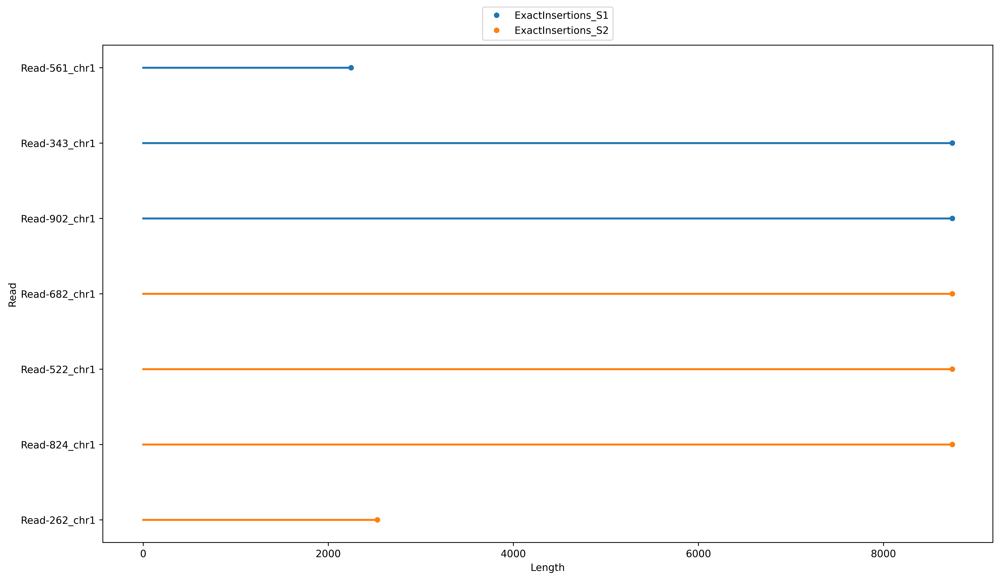

# Tutorial


Now, let's explore a minimal example of what the pipeline can accomplish. To demonstrate this, we’ve simulated some sequencing data and randomly introduced insertions in some of the samples. For more details, refer to [this section](other.md/#simulate_data_for_tutorial).

## Before running the pipeline
---
### Prepare config.yml

To inform the pipeline about the location of our samples and other dependencies, we need to open and edit the configuration file. Open the `config.yml` file and fill in the missing dependencies as outlined below:

```yaml
# tutorial config
experiment: "tutorial"
samples:
    S1: "tutorial/simulated/S1.bam",
    S2: "tutorial/simulated/S2.bam"
processing_dir: "tutorial/out"
vector_fasta: "tutorial/references/vectorseq.fa"
splitmode: "Buffer"
fragment_size: 100
MinLength: 1
MAPQ: 10
MinInsertionLength: 500
ref_genome_ctrl: "tutorial/references/chr1region.fa"
annotation_1: "tutorial/references/UCSC_GENCODEV44_chr1region.bed"
detection: "rules/detection.smk"
quality_control: "rules/qc.smk"
functional_genomics: "rules/functional_genomics.smk"
```
<br>

### Check setup

Before we begin, make sure you have all the necessary files ready. You can quickly verify this by running: 

```bash
    snakemake -n
```

If you see a list of jobs waiting for [execution](#expected-jobs), you're all set for the next steps.

!!! info 
    
    For this tutorial, we will run the workflow using the alternative setup (i.e., one virtual environment). If this isn't the setup you've chosen, simply add `--use-conda` to the snakemake commands. 

<br>

## Running the pipeline
---
### Expected jobs 
!!! danger
    **needs to be modified after the final execution**
```bash
> snakemake --cores 2 -n
...
Job stats:
job                                      count
-------------------------------------  -------
BAM_to_BED                                   2
Non_insertion_mapping                        2
all                                          1
basic_insertion_plots                        1
build_insertion_reference                    1
calc_distance_to_elements                    2
calculate_exact_insertion_coordinates        2
clean_postcut_by_maping_quality              2
collect_outputs                              2
copy_config_version                          1
detailed_fragmentation_length_plot           2
extract_by_length                            2
extract_fastq_insertions                     2
extract_mapping_quality                      2
finalize_mapping_quality                     2
find_vector_BLASTn                           2
find_vector_BLASTn_in_humanRef               2
fragmentation_distribution_plots             2
generate_mapq_heatmap                        2
get_cleavage_sites_for_fasta                 2
hardcode_blast_header                        2
insertion_mapping                            2
make_blastn_DB                               1
make_fasta_without_tags                      2
minimap_index                                1
multiqc                                      1
nanoplot                                     2
plot_distance_to_elements                    2
plot_scoring                                 2
prepare_vector                               1
read_level_fastqc                            2
sort_insertion_file                          2
split_fasta                                  2
vector_fragmentation                         1
total                                       59
```

All of these jobs will be executed in the correct order by the workflow. So let's finally run it.

<br>

### Execution
```bash
    snakemake --cores 2
```
!!! info 
    
    Depending on the number of cores specified and whether the environments need to be built for the first time, this process may take a while. However, since the simulated data is very small, the expected runtime should not exceed 5-10 minutes.

If you see this message, the workflow has executed successfully and completed. If not, refer to the [error handling](#error-handling) section. 

```bash
    Finished job 0.
    59 of 59 steps (100%) done
``` 

Now, run snakemake again with its built-in `--report` functionality to get a comprehensive overview of the workflow's runtime and output. 

```bash
    snakemake --report
```
<br>

## After running the pipeline
---
### Snakemake report

We have also automatically generated a general report for the workflow, which is stored in the working directory of the pipeline. Take a look at the statistics in `report.html`. Some rules took significantly longer to complete than others.


Throughout the pipeline, several simple plots are generated to give insights into the insertions' characteristics, such as their length and chromosomal specificity. Navigate to the results tab to explore the detected insertion lengths. It appears that some reads only contain parts of the insertion.



If you would like to explore quality control metrics, check out the `multiqc.html` report in the results tab. 

<br>

### Output directory structure

Now, let's examine the output files directly generated by the pipeline. Navigate to the output folder as specified in the `config`. To get an overview of the file structure in this directory, run `tree "tutorial/out/tutorial"`. 

!!! danger
    **needs to be modified after the final execution**

<details><summary> Output directory structure </summary>

```plaintext

    ├── config_settings.yml
    ├── final
    │   ├── functional_genomics
    │   │   ├── Functional_distances_to_Insertions_S1.bed
    │   │   ├── Functional_distances_to_Insertions_S2.bed
    │   │   ├── Insertion_Scoring_S1.png
    │   │   ├── Insertion_Scoring_S2.png
    │   │   ├── Plot_Distance_to_Genes_100_S1.png
    │   │   └── Plot_Distance_to_Genes_100_S2.png
    │   ├── localization
    │   │   ├── ExactInsertions_S1.bed
    │   │   ├── ExactInsertions_S2.bed
    │   │   ├── Heatmap_Insertion_Chr.png
    │   │   └── Insertion_length.png
    │   └── qc
    │       ├── Fragmentation
    │       │   ├── Insertions
    │       │   │   ├── insertions_100_S1
    │       │   │   │   ├── 100_fragmentation_distribution.png
    │       │   │   │   └── 100_read_match_fragmentation_distribution.png
    │       │   │   └── insertions_100_S2
    │       │   │       ├── 100_fragmentation_distribution.png
    │       │   │       └── 100_read_match_fragmentation_distribution.png
    │       │   ├── Longest_Interval
    │       │   │   ├── S1
    │       │   │   │   ├── Longest_interval_Read-221.png
    │       │   │   │   ├── Longest_interval_Read-399.png
    │       │   │   │   ├── Longest_interval_Read-46.png
    │       │   │   │   ├── Longest_interval_Read-536.png
    │       │   │   │   └── Longest_interval_Read-628.png
    │       │   │   └── S2
    │       │   │       ├── Longest_interval_Read-328.png
    │       │   │       ├── Longest_interval_Read-347.png
    │       │   │       ├── Longest_interval_Read-389.png
    │       │   │       ├── Longest_interval_Read-532.png
    │       │   │       └── Longest_interval_Read-920.png
    │       │   └── Reference
    │       │       ├── reference_100_S1
    │       │       │   └── 100_fragmentation_distribution.png
    │       │       └── reference_100_S2
    │       │           └── 100_fragmentation_distribution.png
    │       └── multiqc_report.html
    └── intermediate
        ├── blastn
        │   ├── 100_VectorMatches_S1.blastn
        │   ├── 100_VectorMatches_S2.blastn
        │   ├── Annotated_100_VectorMatches_S1.blastn
        │   ├── Annotated_100_VectorMatches_S2.blastn
        │   ├── CleavageSites_100_VectorMatches_S1.blastn
        │   ├── CleavageSites_100_VectorMatches_S2.blastn
        │   ├── Filtered_Annotated_100_VectorMatches_S1.blastn
        │   ├── Filtered_Annotated_100_VectorMatches_S2.blastn
        │   ├── humanref
        │   │   ├── Annotated_100_VectorMatches_S1.blastn
        │   │   ├── Annotated_100_VectorMatches_S2.blastn
        │   │   ├── Filtered_Annotated_100_VectorMatches_S1.blastn
        │   │   └── Filtered_Annotated_100_VectorMatches_S2.blastn
        │   ├── Readnames_100_VectorMatches_S1.txt
        │   └── Readnames_100_VectorMatches_S2.txt
        ├── fasta
        │   ├── Cleaved_S1_noVector.fa
        │   ├── Cleaved_S2_noVector.fa
        │   ├── fragments
        │   │   ├── 100_Vector_fragments.fa
        │   │   ├── 100_Vector_fragments.fa.ndb
        │   │   ├── 100_Vector_fragments.fa.nhr
        │   │   ├── 100_Vector_fragments.fa.nin
        │   │   ├── 100_Vector_fragments.fa.njs
        │   │   ├── 100_Vector_fragments.fa.not
        │   │   ├── 100_Vector_fragments.fa.nsq
        │   │   ├── 100_Vector_fragments.fa.ntf
        │   │   ├── 100_Vector_fragments.fa.nto
        │   │   └── Forward_Backward_Vector.fa
        │   ├── Full_S1.fa
        │   ├── Full_S2.fa
        │   ├── Insertion_S1_Vector.fa
        │   └── Insertion_S2_Vector.fa
        ├── localization
        │   ├── ExactInsertions_S1.bed
        │   ├── ExactInsertions_S2.bed
        │   ├── Sorted_ExactInsertions_S1.bed
        │   └── Sorted_ExactInsertions_S2.bed
        ├── log
        │   ├── detection
        │   │   ├── BAM_to_BED
        │   │   │   ├── Postcut_S1.log
        │   │   │   ├── Postcut_S2.log
        │   │   │   ├── Precut_S1.log
        │   │   │   └── Precut_S2.log
        │   │   ├── basic_insertion_plots
        │   │   │   ├── heat.log
        │   │   │   └── length.log
        │   │   ├── build_insertion_reference
        │   │   │   └── out.log
        │   │   ├── calculate_exact_insertion_coordinates
        │   │   │   ├── S1.log
        │   │   │   └── S2.log
        │   │   ├── clean_postcut_by_maping_quality
        │   │   │   ├── S1.log
        │   │   │   └── S2.log
        │   │   ├── collect_outputs
        │   │   │   ├── S1.log
        │   │   │   └── S2.log
        │   │   ├── copy_config_version
        │   │   │   └── out.log
        │   │   ├── extract_by_length
        │   │   │   ├── S1.log
        │   │   │   └── S2.log
        │   │   ├── find_vector_BLASTn
        │   │   │   ├── S1.log
        │   │   │   └── S2.log
        │   │   ├── find_vector_BLASTn_in_humanRef
        │   │   │   ├── S1.log
        │   │   │   └── S2.log
        │   │   ├── get_cleavage_sites_for_fasta
        │   │   │   ├── S1.log
        │   │   │   └── S2.log
        │   │   ├── hardcode_blast_header
        │   │   │   ├── S1.log
        │   │   │   └── S2.log
        │   │   ├── insertion_mapping
        │   │   │   ├── S1.log
        │   │   │   └── S2.log
        │   │   ├── make_blastn_DB
        │   │   │   └── out.log
        │   │   ├── make_fasta_without_tags
        │   │   │   ├── S1.log
        │   │   │   └── S2.log
        │   │   ├── minimap_index
        │   │   │   └── out.log
        │   │   ├── Non_insertion_mapping
        │   │   │   ├── S1.log
        │   │   │   └── S2.log
        │   │   ├── prepare_vector
        │   │   │   └── out.log
        │   │   ├── split_fasta_by_borders
        │   │   │   ├── S1.log
        │   │   │   └── S2.log
        │   │   └── vector_fragmentation
        │   │       └── out.log
        │   ├── functional_genomics
        │   │   ├── calc_distance_to_elements
        │   │   │   ├── S1.log
        │   │   │   └── S2.log
        │   │   ├── plot_distance_to_elements
        │   │   │   ├── scatter_S1.log
        │   │   │   ├── scatter_S2.log
        │   │   │   ├── violin_S1.log
        │   │   │   └── violin_S2.log
        │   │   ├── plot_scoring
        │   │   │   ├── S1.log
        │   │   │   └── S2.log
        │   │   └── sort_insertion_file
        │   │       ├── S1.log
        │   │       └── S2.log
        │   └── qc
        │       ├── detailed_fragmentation_length_plot
        │       │   ├── S1.log
        │       │   └── S2.log
        │       ├── extract_fastq_insertions
        │       │   ├── S1.log
        │       │   └── S2.log
        │       ├── extract_mapping_quality
        │       │   ├── S1.log
        │       │   └── S2.log
        │       ├── finalize_mapping_quality
        │       │   ├── S1.log
        │       │   └── S2.log
        │       ├── fragmentation_distribution_plots
        │       │   ├── fragmentation_match_distribution_S1.log
        │       │   ├── fragmentation_match_distribution_S2.log
        │       │   ├── fragmentation_read_match_distribution_S1.log
        │       │   └── fragmentation_read_match_distribution_S2.log
        │       ├── generate_mapq_heatmap
        │       │   ├── S1.log
        │       │   └── S2.log
        │       ├── multiqc
        │       │   └── out.log
        │       ├── nanoplot
        │       │   ├── S1.log
        │       │   └── S2.log
        │       └── read_level_fastqc
        │           ├── S1.log
        │           └── S2.log
        ├── mapping
        │   ├── Postcut_S1.bed
        │   ├── Postcut_S1_sorted.bam
        │   ├── Postcut_S1_sorted.bam.bai
        │   ├── Postcut_S1_unfiltered_sorted.bam
        │   ├── Postcut_S1_unfiltered_sorted.bam.bai
        │   ├── Postcut_S2.bed
        │   ├── Postcut_S2_sorted.bam
        │   ├── Postcut_S2_sorted.bam.bai
        │   ├── Postcut_S2_unfiltered_sorted.bam
        │   ├── Postcut_S2_unfiltered_sorted.bam.bai
        │   ├── Precut_S1.bed
        │   ├── Precut_S1_sorted.bam
        │   ├── Precut_S1_sorted.bam.bai
        │   ├── Precut_S2.bed
        │   ├── Precut_S2_sorted.bam
        │   ├── Precut_S2_sorted.bam.bai
        │   └── vector_ref_genome.fa
        └── qc
            ├── fastqc
            │   ├── readlevel_S1
            │   │   ├── S1_read_Read-221.fastq
            │   │   ├── S1_read_Read-221_fastqc.html
            │   │   ├── S1_read_Read-221_fastqc.zip
            │   │   ├── S1_read_Read-399.fastq
            │   │   ├── S1_read_Read-399_fastqc.html
            │   │   ├── S1_read_Read-399_fastqc.zip
            │   │   ├── S1_read_Read-46.fastq
            │   │   ├── S1_read_Read-46_fastqc.html
            │   │   ├── S1_read_Read-46_fastqc.zip
            │   │   ├── S1_read_Read-536.fastq
            │   │   ├── S1_read_Read-536_fastqc.html
            │   │   ├── S1_read_Read-536_fastqc.zip
            │   │   ├── S1_read_Read-628.fastq
            │   │   ├── S1_read_Read-628_fastqc.html
            │   │   └── S1_read_Read-628_fastqc.zip
            │   ├── readlevel_S2
            │   │   ├── S2_read_Read-328.fastq
            │   │   ├── S2_read_Read-328_fastqc.html
            │   │   ├── S2_read_Read-328_fastqc.zip
            │   │   ├── S2_read_Read-347.fastq
            │   │   ├── S2_read_Read-347_fastqc.html
            │   │   ├── S2_read_Read-347_fastqc.zip
            │   │   ├── S2_read_Read-389.fastq
            │   │   ├── S2_read_Read-389_fastqc.html
            │   │   ├── S2_read_Read-389_fastqc.zip
            │   │   ├── S2_read_Read-532.fastq
            │   │   ├── S2_read_Read-532_fastqc.html
            │   │   ├── S2_read_Read-532_fastqc.zip
            │   │   ├── S2_read_Read-920.fastq
            │   │   ├── S2_read_Read-920_fastqc.html
            │   │   └── S2_read_Read-920_fastqc.zip
            │   ├── S1_filtered.fastq
            │   └── S2_filtered.fastq
            ├── mapq
            │   ├── Insertions_S1_mapq.txt
            │   ├── Insertions_S2_mapq.txt
            │   ├── S1_mapq_heatmap_image.png
            │   └── S2_mapq_heatmap_image.png
            ├── multiqc_data
            │   ├── fastqc_adapter_content_plot.txt
            │   ├── fastqc_overrepresented_sequences_plot.txt
            │   ├── fastqc_per_base_n_content_plot.txt
            │   ├── fastqc_per_base_sequence_quality_plot.txt
            │   ├── fastqc_per_sequence_gc_content_plot_Counts.txt
            │   ├── fastqc_per_sequence_gc_content_plot_Percentages.txt
            │   ├── fastqc_per_sequence_quality_scores_plot.txt
            │   ├── fastqc_sequence_counts_plot.txt
            │   ├── fastqc_sequence_duplication_levels_plot.txt
            │   ├── fastqc-status-check-heatmap.txt
            │   ├── fastqc_top_overrepresented_sequences_table.txt
            │   ├── multiqc_citations.txt
            │   ├── multiqc_data.json
            │   ├── multiqc_fastqc.txt
            │   ├── multiqc_general_stats.txt
            │   ├── multiqc.log
            │   ├── multiqc_nanostat.txt
            │   ├── multiqc_software_versions.txt
            │   ├── multiqc_sources.txt
            │   ├── nanostat_aligned_stats_table.txt
            │   └── nanostat_quality_dist.txt
            ├── multiqc_report.html
            └── nanoplot
                ├── S1
                │   ├── AlignedReadlengthvsSequencedReadLength_dot.html
                │   ├── AlignedReadlengthvsSequencedReadLength_dot.png
                │   ├── AlignedReadlengthvsSequencedReadLength_kde.html
                │   ├── AlignedReadlengthvsSequencedReadLength_kde.png
                │   ├── MappingQualityvsReadLength_dot.html
                │   ├── MappingQualityvsReadLength_dot.png
                │   ├── MappingQualityvsReadLength_kde.html
                │   ├── MappingQualityvsReadLength_kde.png
                │   ├── NanoPlot_20241218_1045.log
                │   ├── NanoPlot-report.html
                │   ├── NanoStats.txt
                │   ├── Non_weightedHistogramReadlength.html
                │   ├── Non_weightedHistogramReadlength.png
                │   ├── Non_weightedLogTransformed_HistogramReadlength.html
                │   ├── Non_weightedLogTransformed_HistogramReadlength.png
                │   ├── PercentIdentityHistogramDynamic_Histogram_percent_identity.html
                │   ├── PercentIdentityHistogramDynamic_Histogram_percent_identity.png
                │   ├── PercentIdentityvsAlignedReadLength_dot.html
                │   ├── PercentIdentityvsAlignedReadLength_dot.png
                │   ├── PercentIdentityvsAlignedReadLength_kde.html
                │   ├── PercentIdentityvsAlignedReadLength_kde.png
                │   ├── WeightedHistogramReadlength.html
                │   ├── WeightedHistogramReadlength.png
                │   ├── WeightedLogTransformed_HistogramReadlength.html
                │   ├── WeightedLogTransformed_HistogramReadlength.png
                │   ├── Yield_By_Length.html
                │   └── Yield_By_Length.png
                └── S2
                    ├── AlignedReadlengthvsSequencedReadLength_dot.html
                    ├── AlignedReadlengthvsSequencedReadLength_dot.png
                    ├── AlignedReadlengthvsSequencedReadLength_kde.html
                    ├── AlignedReadlengthvsSequencedReadLength_kde.png
                    ├── MappingQualityvsReadLength_dot.html
                    ├── MappingQualityvsReadLength_dot.png
                    ├── MappingQualityvsReadLength_kde.html
                    ├── MappingQualityvsReadLength_kde.png
                    ├── NanoPlot_20241218_1045.log
                    ├── NanoPlot-report.html
                    ├── NanoStats.txt
                    ├── Non_weightedHistogramReadlength.html
                    ├── Non_weightedHistogramReadlength.png
                    ├── Non_weightedLogTransformed_HistogramReadlength.html
                    ├── Non_weightedLogTransformed_HistogramReadlength.png
                    ├── PercentIdentityHistogramDynamic_Histogram_percent_identity.html
                    ├── PercentIdentityHistogramDynamic_Histogram_percent_identity.png
                    ├── PercentIdentityvsAlignedReadLength_dot.html
                    ├── PercentIdentityvsAlignedReadLength_dot.png
                    ├── PercentIdentityvsAlignedReadLength_kde.html
                    ├── PercentIdentityvsAlignedReadLength_kde.png
                    ├── WeightedHistogramReadlength.html
                    ├── WeightedHistogramReadlength.png
                    ├── WeightedLogTransformed_HistogramReadlength.html
                    ├── WeightedLogTransformed_HistogramReadlength.png
                    ├── Yield_By_Length.html
                    └── Yield_By_Length.png

    68 directories, 256 files
    
```

</details>

<br>

### Output files

#### 1. Localization

The sequence-guided detection of insertions is the core of the workflow. In addition to simply identifying the insertions, several other interesting parameters are automatically evaluated during the execution of the pipeline.

##### Genomic location 


File: `../final/localization/ExactInsertions_{sample}.bed`

**Simulated S1:**
```plaintext

    chr1	36308	38438	Read-628	[35113, 38184]      +
    chr1	104697	110396	Read-399	[103200, 113345]	+
    chr1	129593	131610	Read-536	[126333, 137126]	+
    chr1	375025	380724	Read-221	[367164, 377569]	+
    chr1	385385	387522	Read-46     [378800, 388729]	+
        
```

!!! warning

    The `strand` column in `ExactInsertions_{sample}.bed` refers to the alignment of the read, not the insertion itself.

!!! note 
    
    This file is the primary output and shows the positions of the detected insertions, which are dependent on the reference. It follows the standard [BED6](https://samtools.github.io/hts-specs/BEDv1.pdf) format with the columns: `Chromosome - Start - End - Read - Original Read Start/End - Strand`.
 

##### Orientation and composition

In addition to the main output, it can be useful to examine the orientation of the insertion and the exact composition of the inserted sequence within the read.
    
File: `../final/qc/Fragmentation/Longest_Interval/{sample}/Longest_interval_{read}.bed`

**S1 Read-399:**


The small numbers displayed above the line represent the borders of the matching vector fragments, while the x-axis indicates the actual length in base pairs (bp) of the interval.

The longest consecutively detected interval of this read contained all possible 100 bp vector fragments from 0 to 56, with ambiguous 100 bp matches in the region around positions 32/33 of the insertion sequence. This region of the insertion aligns with the SV40 promoter of the [vector construct](other.md/#vector-map). 

!!! info

    Since the underlying vector sequence FASTA is in the 5'-3' orientation, and this order is maintained in the longest-matching interval of the fragmented sequence, the insertion and the read share the same `+` orientation. 

**S1 Read-536:**


The small numbers displayed above the line represent the borders of the matching vector fragments, while the x-axis indicates the actual length in base pairs (bp) of the interval.

The longest consecutively detected interval of this read included only a subset of all 100 bp vector fragments, resulting in a shorter insertion of approximately 2000 bp. Additionally, the fragment numbers appear to be detected in descending order.

!!! info 
    
    Since the insertion sequence FASTA is oriented in the 5'-3' direction, and this order is **not** preserved in the longest-matching interval of the fragmented sequence, the insertion in the read has a `-` orientation. This indicates that the vector sequence is located in the `-` orientation on a `+` directional read.


#### 2. Quality control

The workflow automatically assesses the quality of the input sequencing data, the alignments performed with and without fragmentation, and the fragmentation itself. This allows not only for detecting insertions but also for evaluating the likelihood of true positives and the overall effectiveness of the search strategy employed by the pipeline. 

##### Input data quality

The pipeline integrates basic quality assessment tools from widely established resources, including [FastQC](), [MultiQC](), and [NanoPlot](). An overview of the results can be accessed via Snakemake's workflow report, which is generated using `snakemake --report` or directly in the output directory.

File: `../final/qc/multiqc_report.html`

!!! Note     
    
    For detailed explanations of the plots provided in the report, consult the documentation of each quality control tool. To access the individual quality control results, navigate to the following directories within the output folder:

    fastqc: `../intermediate/qc/fastqc/`<br>
    multiqc: `../intermediate/qc/multiqc/`<br>
    nanoplot: `../intermediate/qc/nanoplot/`<br>

!!! info 
    
    The pipeline uses fastqc by processing the FASTQ of each read with a detected insertion individually.  


##### Mapping quality

The pipeline incorporates two mapping steps to improve the quality of mapping by modifying reads that contain insertions. These steps are essential for accurately localizing the insertions, making it crucial to track the mapping quality of the affected reads at each key alignment stage. 

 File: `../intermediate/qc/mapq/Insertions_{sample}_mapq.txt`

```plaintext
Read	    PrecutChr	PrecutMAPQ	PostcutChr	PostcutMAPQ	FilteredChr	FilteredMAPQ
Read-221	chr1	    60	        chr1	    60	        chr1        60
Read-399	chr1	    60	        chr1	    60	        chr1	    60
Read-46	    chr1	    60	        chr1	    60	        chr1	    60
Read-536	chr1	    60	        chr1	    60	        chr1	    60
Read-628	chr1	    44	        chr1	    60	        chr1	    60
```
    
The table illustrates changes in mapping quality and chromosome alignment for each read with an insertion across three stages: **Precut** mapping before any modifications, **Postcut** mapping after the reads were modified, and **Filtered** mapping after filtering based on mapping quality. 
    
!!! info 
    
    For S1, the table is relatively straightforward, as all reads except `Read-628` were already perfectly mappable without modifications. In contrast, S2 demonstrates a significant improvement in mapping quality due to the modifications. An example from S2 is shown below. 
    
In this case, the read initially aligned to the vector sequence. However, after the modification (`Buffer`, where every base of the insertion was replaced with `N`), the read became perfectly mappable to a region in the reference genome.
    
```plaintext
Read	    PrecutChr	PrecutMAPQ	PostcutChr	PostcutMAPQ	FilteredChr	FilteredMAPQ
Read-347	FTCAR2[...]	    60	        chr1	    60	        chr1	    60.0
```

##### Fragmentation
The fragmentation process is a crucial step not only for detecting insertions but also for gaining a detailed understanding of the exact composition and orientation of the inserted sequence. Some aspects of fragmentation quality control align closely with the analysis of the [orientation and composition](#orientation-and-composition) of the detected insertions.

However, the analysis of the previously mentioned output files overlooks another critical factor: The existence of fragments with significant sequence similarity to other "normal" sequences in the reference FASTA.

The pipeline includes functionality to perform a BLASTN search of the fragmented insertion sequence against a pre-built version of your reference's BLAST database. To enable this feature, simply specify the `blastn_db` argument in the `config.yml`. 

!!! Danger 
    
    The potential similarity of the insertion sequence to other sequences in your reference is particularly important when using the pipeline in conjunction with complex vector expression systems. For example, CAR T cell vector constructs (like the example [vector](other.md/#vector-map)) often insert sequences partially derived from human genes.

As this option is not configured for the tutorial, we can instead rely on two other automatically generated plots to gain insights into potential false-positive matches for the insertion sequence. 

Directory: `../final/qc/Fragmentation/Insertions_{fragmentsize}_{sample}/`
    

    
These two plots illustrate the distributions of all insertion fragments (left) and the number of fragment matches "contributed" by each read (right).

!!! info 
    
    The `100 bp fragment distribution` reveals that every fragment appears at least once, but fragment 27 is significantly overrepresented among the reads. The `100 bp read match fragment distribution` plot provides an explanation: a few reads, such as `Read-628` or `Read-221`, contribute many fragments to the total, while others, like `Read-932`, contribute only a single fragment.  

!!! info 
    
    Fragment 27 is located within the `hGH poly(A) signal` domain of the [vector](other.md/#vector-map). This region ..., resulting in several small "off-target" insertion matches for this fragment. 
    
!!! Attention 
    
    Observations like these are crucial for determining the most accurate `MinInsertionLength` threshold in the `config.yml`.     

<br>

#### 3. Functional annotation 
Typically, identifying the genomic localization of an insertion is just the starting point, with the proximity to the insertion site being the next area of interest. A basic yet essential functionality for annotating the detected insertion sites is included in the pipeline through the `functional_genomics.smk` rule collection. The pipeline can work with up to four different user-defined BED annotation files that can be provided in the `config.yml` as `annotation_1`, `annotation_2`, `annotation_3`, and `annotation_4`.

##### Genes in proximity

For the tutorial, we have defined only one annotation file in the `config.yml`, which simply contains the known genes located in our specified reference FASTA. For details on generating this file, refer to [this](other.md/#simulate-data-for-tutorial).The pipeline compares the locations of the insertions with the entries in the provided annotation file and reports the closest match, producing the file shown below.

File: `../final/functional_genomics/Functional_distances_to_Insertions_{sample}.bed`

| InsertionChromosome | InsertionStart | InsertionEnd | InsertionRead | InsertionOrig | InsertionStrand | AnnotationChromosome | AnnotationStart | AnnotationEnd | AnnotationID       | AnnotationScore | AnnotationStrand | AnnotationSource                               | Distance |
|---------------------|----------------|--------------|---------------|---------------|-----------------|----------------------|-----------------|---------------|--------------------|-----------------|-------------------|------------------------------------------------|----------|
| chr1                | 36308          | 38438        | Read-628      | [35113, 38184] | +               | chr1                 | 34553           | 36081         | FAM138A            | .               | -                 | UCSC_genes_chr1_0_500000_processed             | -228     |
| chr1                | 104697         | 110396       | Read-399      | [103200, 113345] | +             | chr1                 | 89294           | 120932        | ENSG00000238009    | .               | -                 | UCSC_genes_chr1_0_500000_processed             | 0        |
| chr1                | 129593         | 131610       | Read-536      | [126333, 137126] | +             | chr1                 | 120724          | 133723        | ENSG00000238009    | .               | -                 | UCSC_genes_chr1_0_500000_processed             | 0        |
| chr1                | 375025         | 380724       | Read-221      | [367164, 377569] | +             | chr1                 | 365614          | 379972        | ENSG00000290385    | .               | -                 | UCSC_genes_chr1_0_500000_processed             | 0        |
| chr1                | 385385         | 387522       | Read-46       | [378800, 388729] | +             | chr1                 | 365614          | 379972        | ENSG00000290385    | .               | -                 | UCSC_genes_chr1_0_500000_processed             | -5414    |

Some insertions in the S1 sample are even located directly in gene `ENSG00000238009`, since they show a distance of 0.  

##### Optional visualization? -> Rather for advanced usage?

#### 4. Intermediate files

The workflow generates numerous additional files beyond those listed above. Most of these files are straightforward to understand once you are familiar with the pipeline's functionality. They are typically not critical for most use cases unless [debugging](#error-handling) is required or you integrate [custom downstream rules](advanced_usage.md/#developer-mode) into the analysis.  

Directory: `../intermediate/`

!!! info
    Here is a list of each subdirectory and a description of what to find in them: 

    **`blastn/`**

    - `Filtered_Annotated_{fragmentsize}_InsertionMatches_{sample}.blastn`: Results from the BLASTn searches after filtering 
    - `Coordinates_{fragmentsize}_InsertionMatches_{sample}.blastn`: Dictionary of the identified FASTA coordinates based on insertions in the reads
    - `ref/`: BLASTN matches of vector fragments with provided ref blastdb (empty files if no `blast_db` provided)


    **`fasta/`**

    - `fragments/`: Constructed BLASTN database based on the query insertion
    - `Modified_{sample}_mod.fa`: Modified FASTA file of input BAM (read modification dependent on `Buffer`, `Split`, or `Join`)
    - `Full_{sample}.fa`: Unmodifed FASTA file of input BAM
    - `Insertion_{sample}.fa`: Detected insertion sequences extacted from the reads

    **`localization/`**

    - `ExactInsertions_{sample}.bed`: File as in final output

    **`log/`**

    - See [Error handling](#log-files)

    **`mapping/`**

    - `Precut_{sample}_sorted.bam`: Unmodified Reads after reference mapping
    - `Postcut_{sample}_unfiltered_sorted.bam`: (Modified) Reads after reference mapping
    - `Postcut_{sample}_sorted.bam`: (Modified) Reads passing the quality filter after reference mapping
    - `Postcut_{sample}_sorted.bed`: Genomic locations of aligned reads

    **`qc/`**

    - `fastqc/`: Fastqc input and raw output
    - `multiqc_data/`: Multiqc raw output
    - `nanoplot/`: Nanoplot raw output
    - `multiqc_report.html`: Report as in final output

---

## Error handling

#### Snakemake
General debugging ressources for everything related to snakemake can be found in the snakemake [FAQ](https://snakemake.readthedocs.io/en/v6.15.5/project_info/faq.html).

#### Log files
The pipeline is designed with rule-specific `log` files, which are stored in the `intermediate` output directory. These logs serve as the primary resource for identifying and addressing any rule-specific issues that arise during execution. If you encounter errors or unexpected behavior, these files should be your first point of reference for debugging. 